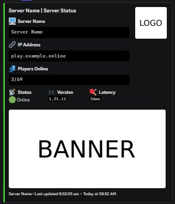
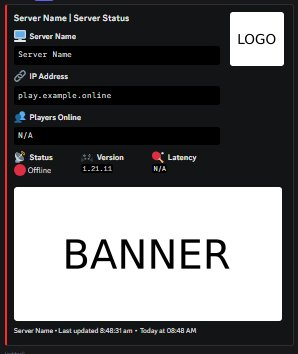

<div align="center">

# ⛏️ MC Status Bot

[](https://nodejs.org)
[](https://discord.js.org)
[](LICENSE)
[]()

**A lightweight Discord bot that displays your Minecraft server's live status in a clean, auto-updating embed.**
Inspired by FiveM status panels like Zion City and CrestMC.

[Features](#-features) · [Setup](#-setup) · [Configuration](#️-configuration) · [Preview](#-preview)

</div>

---

## ✨ Features

| Feature | Description |
|---|---|
| 🔄 **Auto-updating embed** | Refreshes every X seconds, edits the same message — no channel spam |
| 🟢 **Live server status** | Shows online/offline, player count, version and latency in real time |
| 💾 **Persistent panel** | Survives bot restarts — always edits the same message |
| 🖼️ **Logo & banner support** | Works with both `.png` and animated `.gif` images |
| 🎨 **Fully configurable** | Change colors, server info, and update interval from one config file |
| 🤖 **Bot presence** | Displays live player count in the bot's Discord status |

---

## 📸 Preview

<div align="center">

<table>
  <tr>
    <td align="center">
      
      <br/>
      <sub><b>🟢 Server Online</b></sub>
    </td>
    <td align="center">
      
      <br/>
      <sub><b>🔴 Server Offline</b></sub>
    </td>
  </tr>
</table>

</div>

---

## 🚀 Setup

### 1. Clone the repo

```bash
git clone https://github.com/yourusername/mc-status-bot.git
cd mc-status-bot
```

### 2. Install dependencies

```bash
npm install
```

### 3. Configure the bot

Edit `config.json` with your details:

```json
{
  "token": "YOUR_BOT_TOKEN",
  "channelId": "YOUR_CHANNEL_ID",
  "embedColorOnline": "#2ecc71",
  "embedColorOffline": "#e74c3c",
  "updateIntervalSeconds": 30,
  "animatedLogo": false,
  "animatedBanner": false,
  "botStatus": "online",
  "minecraft": {
    "host": "play.yourserver.com",
    "port": 25565,
    "name": "YourServer",
    "version": "1.21"
  }
}
```

### 4. Add your images

Place these files in the bot folder:

```
logo.png   (or logo.gif for animated)
banner.png (or banner.gif for animated)
```

### 5. Run the bot

```bash
node bot.js
```

---

## ⚙️ Configuration

| Key | Type | Description |
|---|---|---|
| `token` | `string` | Your Discord bot token |
| `channelId` | `string` | Channel to post the status panel in |
| `embedColorOnline` | `hex` | Embed color when server is online |
| `embedColorOffline` | `hex` | Embed color when server is offline |
| `updateIntervalSeconds` | `number` | How often to refresh the panel (in seconds) |
| `animatedLogo` | `boolean` | Set `true` to use `logo.gif` instead of `logo.png` |
| `animatedBanner` | `boolean` | Set `true` to use `banner.gif` instead of `banner.png` |
| `botStatus` | `string` | Bot presence — `online`, `idle`, `dnd`, or `invisible` |
| `minecraft.host` | `string` | Your server IP or domain |
| `minecraft.port` | `number` | Server port (default `25565`) |
| `minecraft.name` | `string` | Display name shown in the embed |
| `minecraft.version` | `string` | Version string shown in the embed |

---

## 📦 Dependencies

- [discord.js](https://discord.js.org/) — Discord API wrapper for Node.js
- [minecraft-server-util](https://www.npmjs.com/package/minecraft-server-util) — Minecraft server status pinger

---

## 🛡️ Requirements

- Node.js **v16 or higher**
- A Discord bot token — [create one here](https://discord.com/developers/applications)
- A Minecraft server with a public IP or domain

---

## 📄 License

[MIT](LICENSE) — free to use, modify, and share.
Contributions and PRs are welcome!

---

<div align="center">
  <sub>Made with ❤️ for the Minecraft community</sub>
</div>
